# Mise en place d'un traqueur GPS via LoRa(Wan)


```plantuml
GPS -[#red]> Raspberry : Coordonnées GPS
Raspberry -[#black]> LoRa : Coordonnées GPS
LoRa -[#green]> Routeur : Coordonnées GPS
Routeur -[#blue]> TheThingsNetwork : Coordonnées GPS
TheThingsNetwork -[#red]> Cayenne : Coordonnées GPS
```

## Installation du routeur sur Internet (via WiFi)

N.B. : Pourquoi via WiFi ? Dans le cas particulier de l'Université de Perpignan Via Domitia, le FireWall "n'aime" pas les connections sur le port 1700 nécessaire à l'établissement de la connection routeur -> TheThingsNetwork.

- On le branche sur secteur via USB-C 5V-2A
un réseau WiFi dragino-XXXXXX apparait. 
- On se connecte à ce réseau via le mot de passe par défault du routeur :
"dragino+dragino" (sans les guillemets)
- Sur le navigateur on va sur l'IP 10.130.1.1 un couple Id/MdP est demandé par le dragino (par défaut) "root" / "dragino"
- Pour le WiFi Client (Le dragino fournit pour l'instant un serveur web mais n'est pas connecté à Internet !) On clique sur Enable WiFi-Wan Client avec le couple SSID/MdP d'un smartphone par example.
  
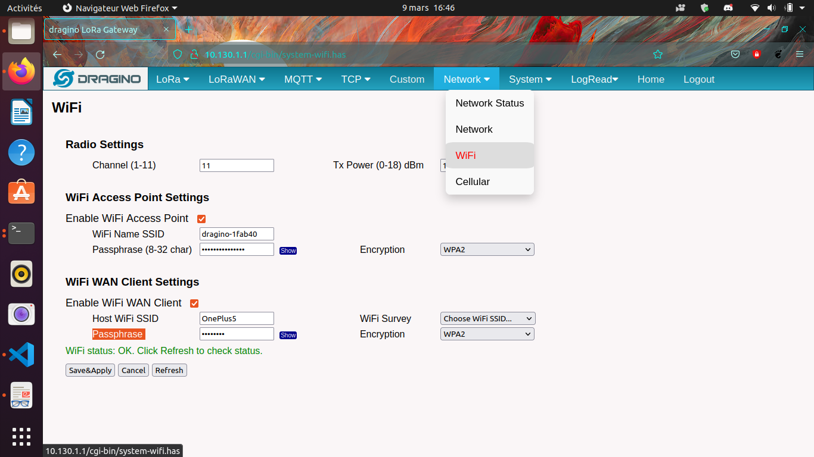

## Routage des paquets LoRa vers TheThingsNetwork

- Créer un compte TheThingsNetwork.org (gratuit il faut fournir son courriel)
- On peut voir l'identifiant par défaut du routeur (le Gateway EUI) sur l'onglet LoRa du serveur web du routeur (10.130.1.1)
- De plus il faut choisir TheThingsNetwork v3 sur le menu déroulant en dessous (le v2 est disponible sur le routeur mais TheThingsNetwork qui maintient sa version 2 pour les anciens routeurs ne permet pas la création de nouveaux routeurs en v2)
- Il faut aussi choisir eu1.cloud.thethings.network sur le deuxième menu déroulant confère images ci dessous.

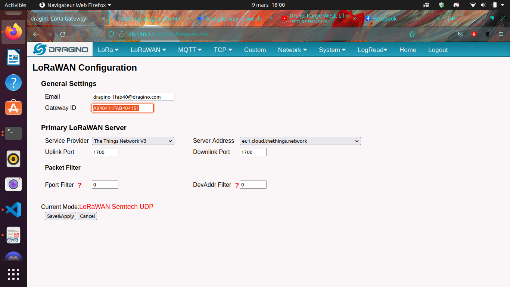

L'identifiant du routeur (Gateway EUI) doit être le même que dans la configuration précedente. Le GatewayID est libre mais doit être unique sur ttn donc disponible. Le Gateway Name est quant à lui totalement libre.
Enfin les Gateway Server Address doit correspondre au précedent soit pour l'Europe :
eu1.cloud.thethings.network

Le reste des options peut être laissé par défaut ou changé (si on sait pourquoi ;))

Ca y est vous avez votre routeur connecté sur le LoRaWan.

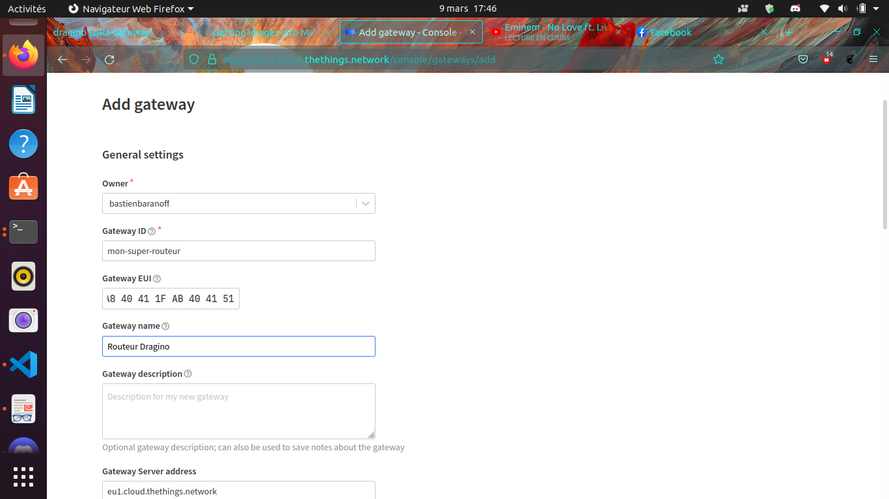

## Préparation du RaspberryPi (l'objet connecté)

Un raspberry est un micro-ordinateur à peut près de la taile d'une CB avec la puissance d'un smartphone et des broches d'entrées-sortie électriques. Le système d'exploitation de ce matériel se trouve (en général et dans cette étude, sinon il peut être via NetBoot, USB, HDD, emmc) sur une carte SD préparée par exemple de la manière suivante :

### La carte SD :

Télécharger Raspi-Imager sur le site officiel de Raspberry
https://www.raspberrypi.com/software/

Pour installer raspi-imager sur un ordinateur hôte ubuntu récent il suffit d'ouvrir une fenêtre de commandes (Ctrl-Alt-T) et de taper

```bash
sudo snap install rpi-imager
```

Ensuite on sélectionne l'OS suivant (Debian Bullseye le premier de la liste et le dernier existant au moment où sont écris ces mots)

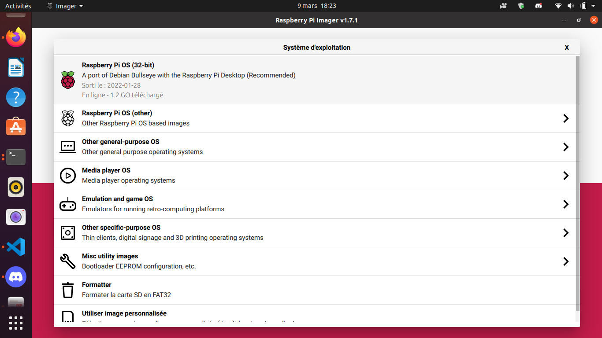

et on sélectionne les options suivantes

ssh : username/password (conseil : "pi"/"raspberry")
Wifi : le WiFi du télephone ou n'importe lequel auquel on a accès
optionnel : set hostname = raspberry.local

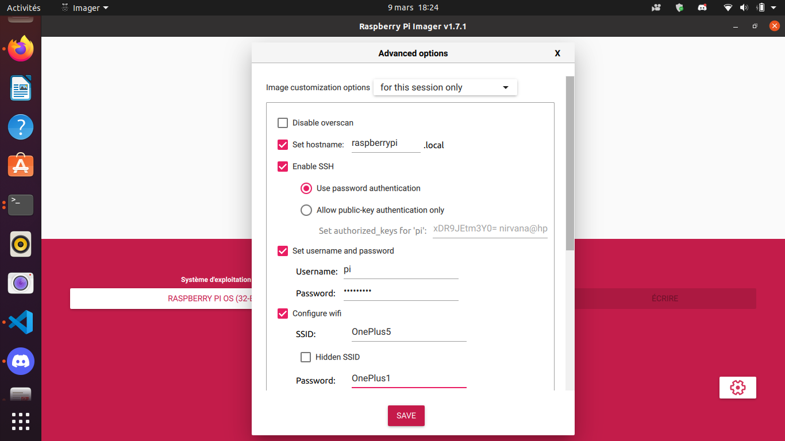

Ensuite on sélectionne le media sur lequel on va écrire et on choisi enfin écrire.

On met la carte une fois terminé ça y est le raspberry devrait tourner avec un OS. On peut vérifier via HDMI sur un écran. Ou si on veut on peut accéder en ssh si l'ordinateur se trouve sur le même réseau local que le raspberry.
Si le réseau est en 192.168.1.0/24 il faut faire

```bash
nmap 192.168.1.1-254 -p 22
```

pour connaître l'adresse du rpi. Ou encore si on ne connait pas les octets de l'ip du gateway

```bash
sudo arp -a
```

Enfin pour accéder à un shell sur ce même rpi 

```bash
ssh pi@ip_du_pi_trouvée_précedemment
```

ou 

```bash
ssh pi@raspberrypi.local
```

### Installation et configuration du Hat Dragino (GPS/LoRa) sur le raspberry 

Une fois sur le shell du rpi comme toujours :

```bash
sudo apt update && sudo apt upgrade
```

Ensuite on installe les paquets nécessaires :

```bash
sudo apt install git device-tree-compiler git python3-crypto python3-nmea2 python3-rpi.gpio python3-serial python3-spidev python3-configobj gpsd libgps-dev gpsd-clients python3-pip
pip3 install simplecayennelpp
```
git clone https://github.com/bbaranoff/libgps
cd libgps
make 
sudo make install
sudo ldconfig
nano /etc/default/gpsd
```
# Default settings for the gpsd init script and the hotplug wrapper.

# Start the gpsd daemon automatically at boot time
START_DAEMON="true"

# Use USB hotplugging to add new USB devices automatically to the daemon
USBAUTO="false"

# Devices gpsd should collect to at boot time.
# They need to be read/writeable, either by user gpsd or the group dialout.
DEVICES="/dev/ttyAMA0"

# Other options you want to pass to gpsd
GPSD_OPTIONS="-n"
```

Ensuite on rajoute au fichier /boot/config.txt les lignes suivantes :

```
enable_uart=1
dtoverlay=miniuart-bt
dtoverlay=spi-gpio-cs
```
On modifie le fichier /boot/cmdline.txt de façon à ce qu'il devienne

```
dwc_otg.lpm_enable=0 console=tty1 root=/dev/mmcblk0p2 rootfstype=ext4 elevator=deadline fsck.repair=yes rootwait
```

Ensuite dans le /home/pi

```bash
git clone https://github.com/computenodes/dragino
cd dragino/overlay
dtc -@ -I dts -O dtb -o spi-gpio-cs.dtbo spi-gpio-cs-overlay.dts
sudo cp spi-gpio-cs.dtbo /boot/overlays/
sudo reboot
```

Ensuite dans /home/pi on crée le fichier gpscron tel que :

```bash
#!/bin/bash
sudo python3 /home/pi/dragino/test_cayenne.py
```
dans /home/pi/dragino on écrit le fichier test_cayenne.py tel que :

```python
#!/usr/bin/env python3
"""
    Test harness for dragino module - sends hello world out over LoRaWAN 5 times
"""
import logging
from datetime import datetime
from time import sleep
import RPi.GPIO as GPIO
from dragino import Dragino
#import subprocess
import gpsd
from simplecayennelpp import CayenneLPP # import the module required to pack th$
import binascii
# importing the module
# Connect to the local gpsd
gpsd.connect()
packet = gpsd.get_current()
# See the inline docs for GpsResponse for the available data
print(packet.position())
lat = packet.lat
lon = packet.lon
alt = packet.alt

print (lat, lon, alt)
lpp = CayenneLPP()
lpp.addGPS( 1, lat, lon, alt)
text=binascii.hexlify(lpp.getBuffer()).decode()
sent=list(binascii.unhexlify(text))
print(text)
logLevel=logging.DEBUG
logging.basicConfig(filename="test.log", format='%(asctime)s - %(funcName)s - %(lineno)d - %(levelname)s - %(message)s', level=logLevel)
D = Dragino("/home/pi/dragino/dragino.ini", logging_level=logLevel)
D.join()
while not D.registered():
    print("Waiting for JOIN ACCEPT")
    sleep(2)
for i in range(0, 2):
    D.send_bytes(sent)
    start = datetime.utcnow()
    while D.transmitting:
        pass
    end = datetime.utcnow()
    print("Sent GPS coordinates ({})".format(end-start))
    sleep(1)
```

On prend le fichier /home/pi/dragino/dragino.ini.default et on le réecrit sous /home/pi/dragino/dragino.ini de la manière suivante

```
gps_baud_rate = 9600
gps_serial_port = /dev/ttyS0
gps_serial_timeout = 1
gps_wait_period = 10

#LoRaWAN configuration
spreading_factor = 7
max_power = 0x0F
output_power = 0x0E
sync_word = 0x34
rx_crc = True
#Where to store the frame count
fcount_filename = .lora_fcount

##Valid auth modes are ABP or OTAA
##All values are hex arrays eg devaddr = 0x01, 0x02, 0x03, 0x04
#auth_mode = "abp"
#devaddr = 
#nwskey = 
#appskey =

auth_mode = otaa
deveui = 0xFF, 0xFE, 0xFD, 0xFC, 0xFC, 0xFD, 0xFE, 0xFF
appeui = 0x70, 0xB3, 0xD5, 0x00, 0x00, 0xD5, 0xB3, 0x70
appkey = 0x3D, 0x83, 0xC3, 0x16, 0x2C, 0xAD, 0x44, 0xB7, 0xB0, 0x50, 0x6C, 0x3C, 0xA1, 0x54, 0x36, 0xB7
```

En choisissant les deveui, appeui de façons à ce qu'ils soient uniques sur ttn. Et l'appkey avec suffisament d'entropie pour ne pas qu'on puisse la brute-forcer.

Enfin pour executer le script python toutes les minutes :

```bash
sudo crontab -e
```
On sélectionne son éditeur préféré
et on ajoute la ligne

```
* * * * * /home/pi/gpscron
```

à la fin du fichier.
Du coté du raspberry tout doit être prêt maintenant

## Connection de l'objet au LoRaWan (thethingsnetwork)

On va dans applications on créé une application ensuite on va dans enddevices et on choisi + Add Endevice

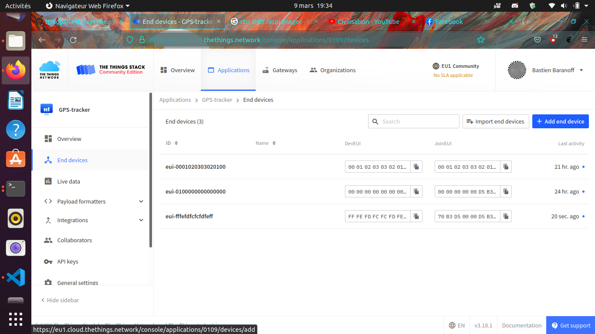

Ensuite on choisi les paramètres de l'objet (AppEUI, DevEUI, AppKey) pour qu'ils correspondent à ceux établis précédemments dans /home/pi/dragino/dragino.ini

soit dans l'exemple de cette étude :

```
deveui = 0xFF, 0xFE, 0xFD, 0xFC, 0xFC, 0xFD, 0xFE, 0xFF
appeui = 0x70, 0xB3, 0xD5, 0x00, 0x00, 0xD5, 0xB3, 0x70
appkey = 0x3D, 0x83, 0xC3, 0x16, 0x2C, 0xAD, 0x44, 0xB7, 0xB0, 0x50, 0x6C, 0x3C, 0xA1, 0x54, 0x36, 0xB7
```

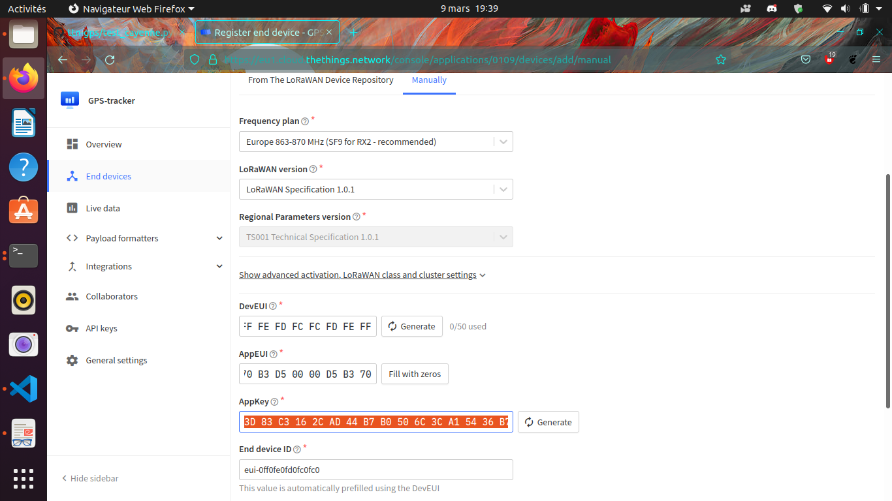


Démarrer le pi (truc et astuces pour le GPS !!!!!)

Sur le shell du pi :

```bash
sudo ntpdate fr.pool.ntp.org
```
Mettre le RPi en extérieur
Débrancher le jumper GPS Tx du Hat dragino alimenter le RPi attendre le 3D fix (la diode verte du dragino, pas du RPi) et brancher (à chaud) le jumper Tx.

Ca devrait y être vous avez votre premier (?) objet connecté (au LoRaWan)

## Format du message

Enfin dans le cas de cette étude nous avons choisi de mettre le payload sous la forme CayenneLPP on verra pourquoi par la suite. Pour que TheThingsNetwork puisse interpréter le payload il faut le lui dire 

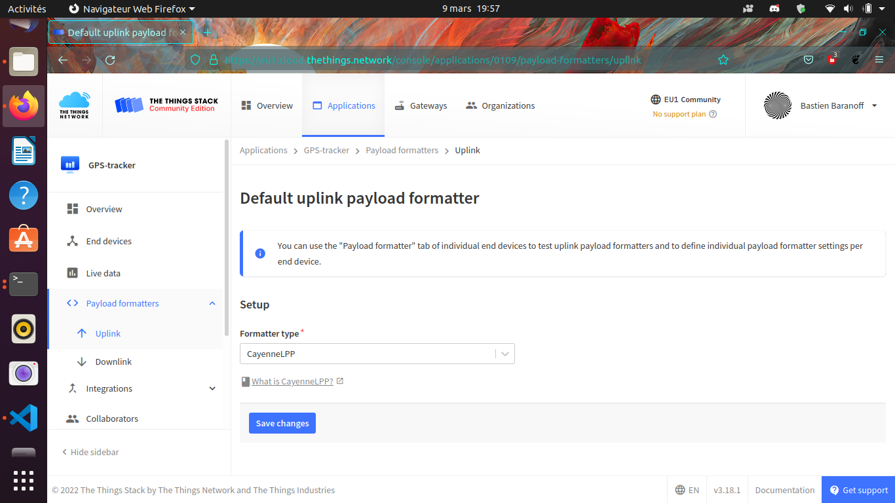


Pour voir l'objet sur ttn allez dans l'application que vous venez de créer séléctionner votre enddevice  et live data vous devriez voir quelquechose comme

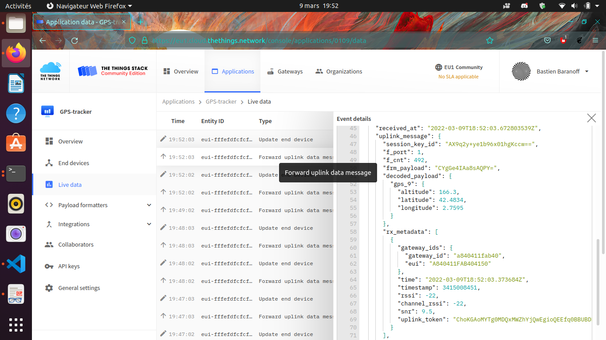

## Gestion des données (Intégration à Cayenne)

Aller sur https://mydevices.com/

Créer un compte Cayenne

Séléctionner TheThingsNetwork

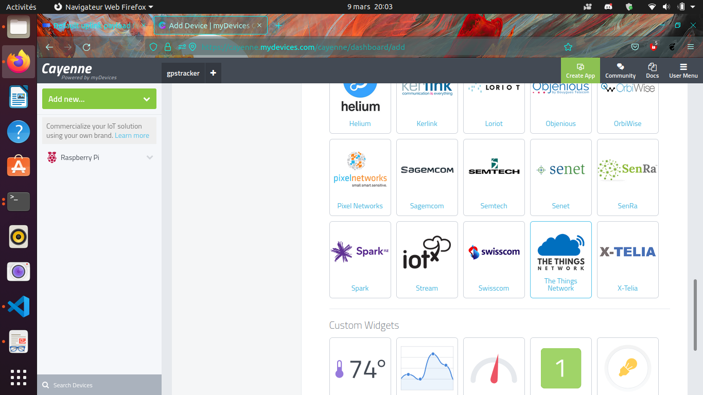

Sélection Dragino RPi Hat et mettre le DevEUI

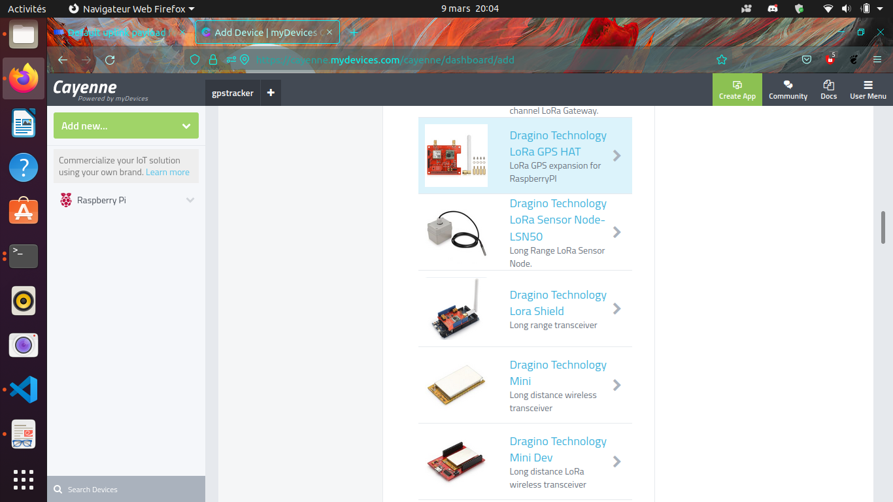

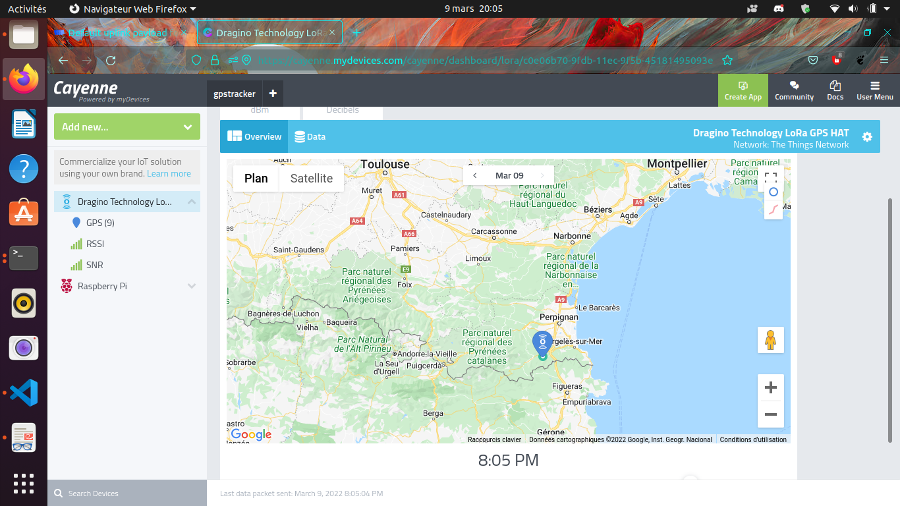

Données en live du traqueur GPS !!!!!!!!!!
